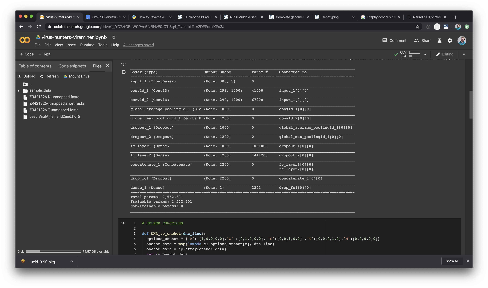
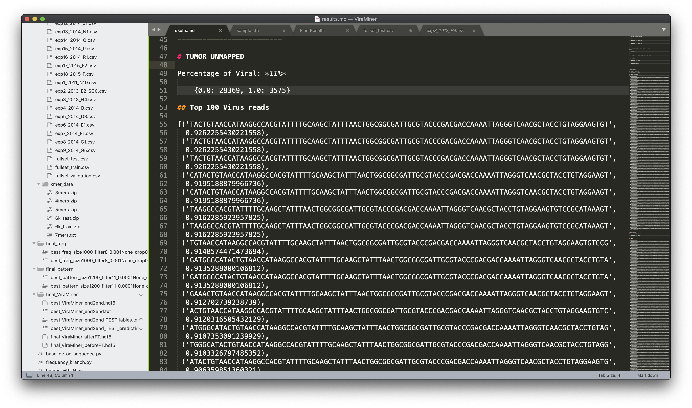
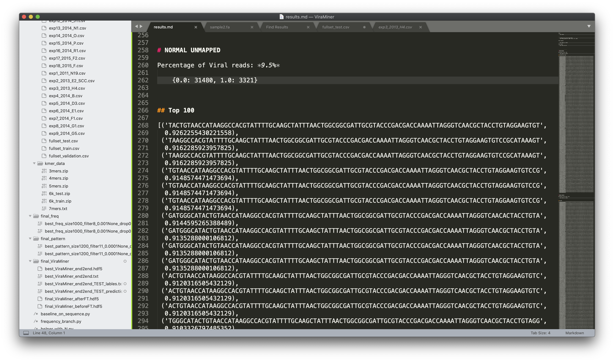
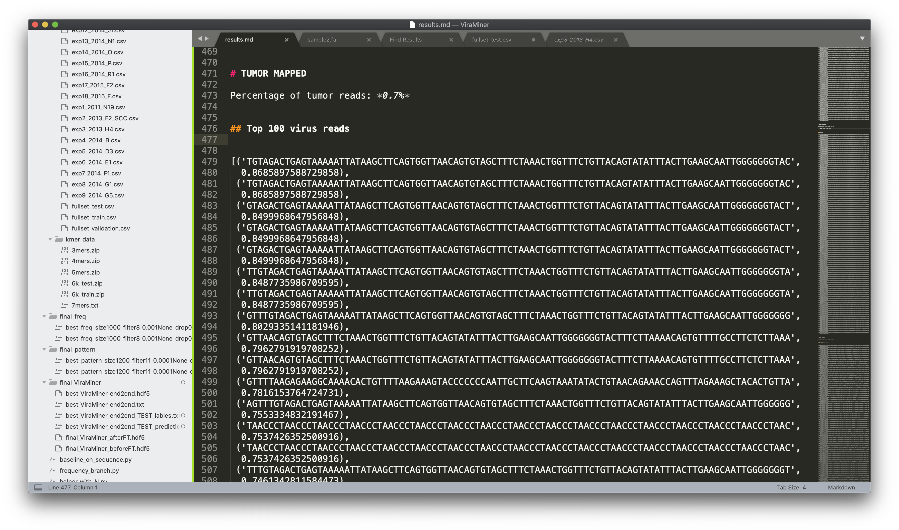

slidenumbers: true
footer: Hackathon Leila’s Case, 2020-01-12

# [fit] Virus Hunters

- Cosmo Mielke
- Onno Faber

---

# Finding Virus data in Tumor and Normal WES/WGS/RNA

- How much viral data is there in both tissue types
- Using *unmapped* data from the BAM files as well as *mapped* data as a control
- Using a pre-trained model from [*ViraMiner*](https://github.com/NeuroCSUT/ViraMiner) called *best_ViraMiner_end2end.hdf5*

---

# Tools

- Google Colab notebook, importing relevant *fasta* files and *models*

---

# Tumor Tissue Unmapped

Percentage of Viral: *11%*

	{0.0: 28369, 1.0: 3575}

---

# Normal Tissue Unmapped

Percentage of Viral: *9.5%*

	{0.0: 31480, 1.0: 3321}

---

# Tumor Tissue Mapped

We took out reads from the BAM file that have been mapped to the human reference genome.

Percentage of Viral: *0.7%*

	{0.0: 43072, 1.0: 293}

---

# Next Steps

1. Map reads of suggested viruses to actual virus
2. Frequency of the viruses
3. Run it on other data (RNA, WGS)

